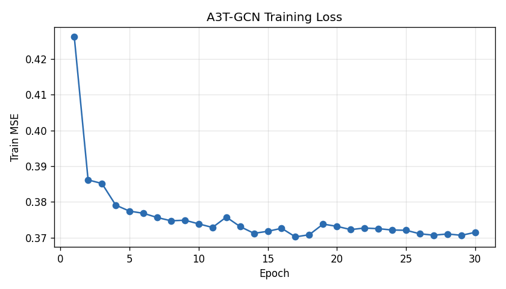
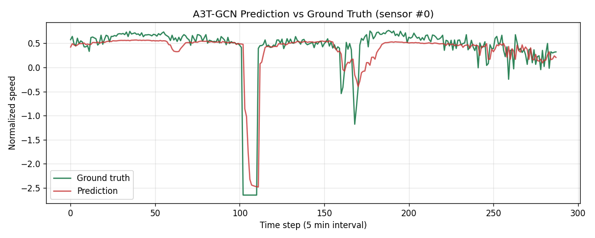

# 基于图神经网络的城市交通速度预测 (A3T-GCN)

本项目基于**时空图神经网络**解决**智能交通系统中的交通速度预测**问题。
采用注意力时空图卷积网络 **A3T-GCN**(Attention Temporal Graph Convolutional
Network),在真实路网数据 **METR-LA** 上对每个传感器未来 1 小时(12 个 5-min
时间步)的车速进行多步预测。

> 课程要求:基于图神经网络相关技术解决一个实际问题,提交包括数据(部分)、代码、文档。

## 方法概述

交通预测的核心难点在于**空间依赖**(相邻路段相互影响)与**时间依赖**
(历史时序的演化规律)的耦合。A3T-GCN 同时建模两者:

- **GCN**(图卷积):基于路网邻接矩阵聚合相邻传感器信息,捕获空间相关性;
- **GRU**(门控循环单元):学习交通时间序列的短时趋势;
- **注意力机制**:对不同历史时间步赋予不同重要性,汇聚全局时序信息以提升精度。

模型实现使用 [PyTorch Geometric Temporal](https://github.com/benedekrozemberczki/pytorch_geometric_temporal)
的 `A3TGCN2` 单元。

数据处理流程(与方案 PPT 一致):
`原始网格速度数据 → 构建路网图 → 速度归一化 → 构建时空图样本 → A3T-GCN 训练 → 评估 → 可视化`

## 数据集

- **METR-LA**:洛杉矶都会区 207 个环形检测器,2012.03–2012.06,每 5 分钟采样,
  共 34272 个时间步。
- 输入:过去 12 个时间步(1 小时)的 2 维节点特征(归一化速度 + 一天内时刻);
  输出:未来 12 个时间步的速度。
- 训练/测试按时间顺序 8:2 划分。
- 仓库内提交了部分数据样本,见 [`data/README.md`](data/README.md);完整数据训练时自动下载。

## 目录结构

```
.
├── src/
│   ├── model.py     # A3T-GCN 模型定义
│   ├── train.py     # 训练 / 评估 / 可视化主程序
│   └── utils.py     # 评估指标 (MAE / RMSE / MAPE)
├── data/
│   ├── sample/      # 提交的部分数据 (节点速度样本 + 邻接矩阵)
│   └── README.md
├── results/         # 指标 + 训练曲线 + 预测对比图 (训练后生成)
├── requirements.txt
└── README.md
```

## 环境与运行

```bash
pip install -r requirements.txt

# 训练 (CPU 可运行, 默认限制样本量以加速)
python src/train.py --epochs 30 --max-samples 6000

# 使用全部数据训练
python src/train.py --epochs 30 --max-samples 0
```

运行后在 `results/` 生成:
- `metrics.json` — 测试集 MAE / RMSE / MAPE 等指标;
- `training_loss.png` — 训练损失曲线;
- `prediction_vs_truth.png` — 某传感器预测值与真实值对比;
- `a3tgcn_model.pt` — 训练好的模型权重。

## 实验结果

下表为一次 30 epoch、6000 训练样本(CPU)的结果,完整指标见
[`results/metrics.json`](results/metrics.json):

| 模型     | 数据集   | 预测视野 | MAE (归一化) | RMSE (归一化) | MAE (mph) | RMSE (mph) | MAPE (%) |
|----------|----------|----------|--------------|---------------|-----------|------------|----------|
| A3T-GCN  | METR-LA  | 12×5min  | 0.4462       | 0.7494        | 9.04      | 15.18      | 18.99    |

> 速度特征均值约 53.7 mph、标准差约 20.3 mph;真实速度尺度的 MAE/RMSE 由归一化误差
> 乘以标准差还原得到,MAPE 在真实速度尺度上计算(掩去 METR-LA 用 0 表示的缺失值)。
> 使用全量数据并增大 epoch 可进一步降低误差。




## 参考

- Zhu *et al.*, *A3T-GCN: Attention Temporal Graph Convolutional Network for
  Traffic Forecasting*, ISPRS Int. J. Geo-Inf. 2021. https://arxiv.org/abs/2006.11583
- Rozemberczki *et al.*, *PyTorch Geometric Temporal*, CIKM 2021.
  https://github.com/benedekrozemberczki/pytorch_geometric_temporal
